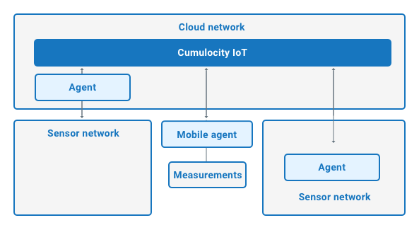
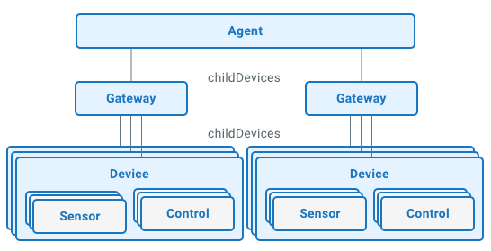
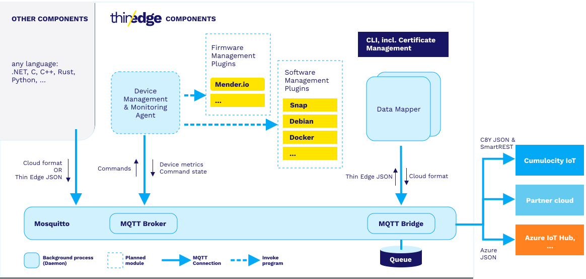

# Cumulocity with thin-edge demo

Contents:
* Cumulocity overview
* thin edge overview
* demo
* Useful tools


# Cumulocity

Cumulocity is a cloud platform centered on IoT needs with a focus on ease of use and rapid deployment. As a cloud service it is limited compared to Azure or AWS for example, only offering services needed for device integration, management and data processing. [Docs](https://cumulocity.com/docs/)

Cumulocity does support tenant hierarchies, i.e. enterprise tenants which have subtenants under them. Also they offer the option to run cumulocity cloud on customer's own datacenter or server, in which case all data is presumably fully under customer's control.

## Agents

Devices connect to the cloud via agents. Agents can be run on premises on the device, a gateway etc, or on the cloud. Cloud agents are mainly intended for scenarios where device is "closed" and only allows for a predefined way to connect.



Agents support child device hierarchies (communication hierarchy)



Agents can communicate with the cloud with HTTP(S) or MQTT protocols. Agents send measurements, events and alarms and receive operations. They are queued on both ends and support low availability networks.

## Cloud

The cloud is quite limited compared to a fully fledged cloud service like Azure or AWS. It offers prebuilt web applications for administration, cockpit, device management, digital twin management etc. in the portal. These can be extended or branded (say, making a new widget for cockpit), although they seem to be Angular JS based and at least their SDK is depracated.

Some supported features:
* Hosting web applications that can use whatever HTML5/javascript-based frameworks you want. 
* Hosting backend services running as docker based microservices on cumulocity-hosted kubernetes.
* Real-time processing of incoming measurements, events and alarms.
    * They offer a no-code solution that can do some things
    * More interestingly, they have the so called Apama event processing language for more complex processing
        * Resembles java, but is limited

----------------------------------
# thin-edge.io

Open source (Apache 2.0 license) cloud agonstic IoT framework written in Rust, designed for resource constrained edge devices. [Docs](https://thin-edge.github.io/thin-edge.io/start/getting-started/) [Github](https://github.com/thin-edge/thin-edge.io)

Architecture in a nutshell:
* Central MQTT bus for all communication (Mosquitto)
* Data mapper translates thin edge MQTT messages to cloud formats. At least Cumulocity, Azure and AWS supported out of the box.
* Agent executes commands like software management, firmware updates, configuration updates etc.
* Custom services interact via MQTT as well, for example publishing to the topic `te/device/main///m/` is picked up by the data mapper, translated to the cloud specific formats and sent to the cloud(s)



---

# Demo

Quick tour of cumulocity portal
SSH to raspberry pi
Install thin edge
Install measurements script
Install custom operation

## Measurements

[Simple motion sensor example](./motion-sensor/README.md)

## Device control

Thin edge offers a set of operations it can do out of the box. Default operations can be overridden if desired and new ones added.

```
pi@raspberrypi:~ $ ls /etc/tedge/operations/c8y/
c8y_DownloadConfigFile  c8y_LogfileRequest  c8y_RemoteAccessConnect  c8y_Restart  c8y_SoftwareUpdate  c8y_UploadConfigFile
```

## Custom operations

1) Add smart rest template to trigger operation: import [smart-rest-template.json](./set-light/smart-rest-template.json) to cumulocity smart rest templates

2) Configure the template in thin edge: `sudo tedge config set c8y.smartrest.templates simple_light_control`

3) Reconnect thin edge to synchronize inventory: `sudo tedge reconnect c8y`
> Tip: you can verify the template is configured by checking the file `less /etc/tedge/mosquitto-conf/c8y-bridge.conf`
> It should contain lines:
```
topic s/uc/simple_light_control out 2 c8y/ ""
topic s/dc/simple_light_control in 2 c8y/ ""
``` 

> Tip: You can also verify the message is delivered correctly by listening to the cloud topic: `tedge mqtt sub 'c8y#'`
> To send an operation, use c8y cli: `c8y identity get --name raspi_01 | c8y operations create --template "{'set_light':{lightid:1,on:true}}"`

4) Create custom operations handler on thin edge:
Add a file to `/etc/tedge/operations/c8y` as the tedge user: ```sudo -u tedge touch /etc/tedge/operations/c8y/set_light```
Edit the [set_light](./set-light/set_light) and save

5) Create the [script](./set-light/simpleLightControl.sh) that will be executed and make sure it has permissions
> Tip: check file permissions: `ls -l`, set execute permissions for all users: `chmod +x simpleLightControl.sh`

6) Create an operation (see above) and veryfiy that the scrip ran. It should produce a log file, configured inside the script.

-----------------------------

# Tools
## go-c8y-cli unofficial CLI tool
Command line interface for cumulocity API: https://goc8ycli.netlify.app

Supports piping, for example:

```c8y operations list --status PENDING | c8y operations update --status FAILED```

Needs to start a session to the cloud to work. For connecting first time use:

```
c8y sessions create \
    --host "https://mytenant.eu-latest.cumulocity.com" \
    --username "myUser@me.com" \
    --type dev
```

For subsequent reconnects:

`eval $(c8y sessions set --shell bash)`
